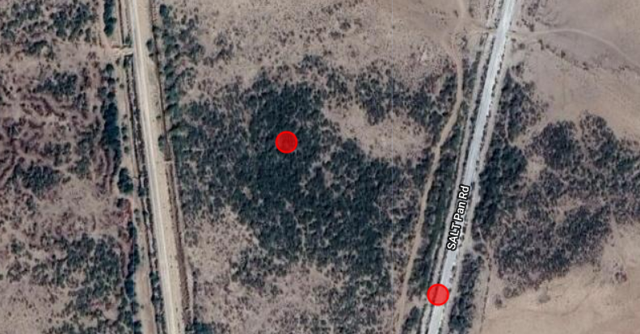
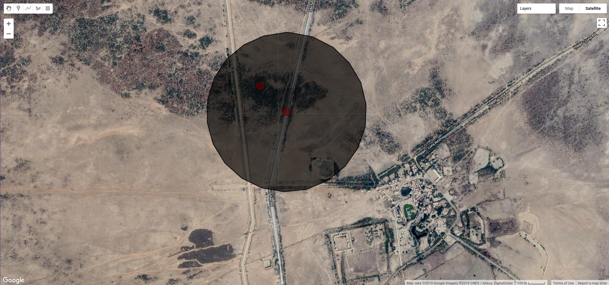
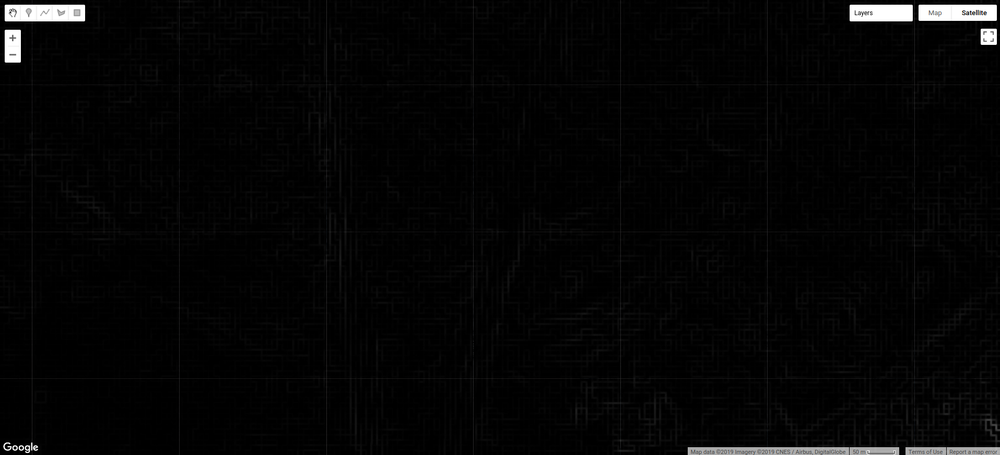
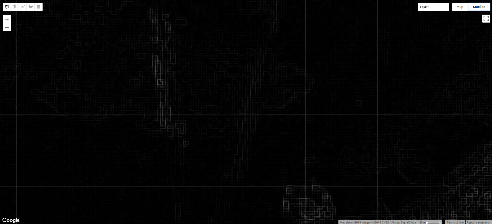
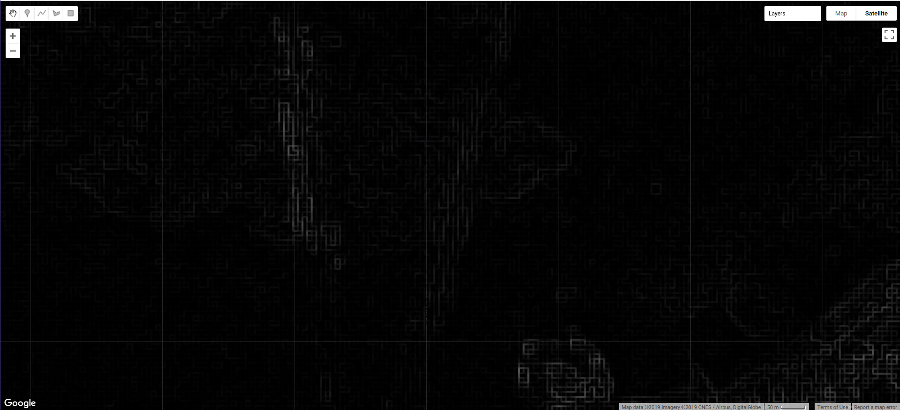

---
author:
- Shristi Shreya Singh
title: Work Done
---

Initial approach {#sec:org13194b1}
================

We were provided with ground truth points for the Prosopis Juliflora and
Lantana Camara. The ground truth points provided were of the following
regions:

-   **P. Juliflora** - Tamil Nadu, Gujrat, Western Ghats

-   **L. Camara** - Karnataka

We first tried to experiment with the latitude, longitude of the given
ground truth points for both P. Juliflora and L. Camara. using the
`inspector` in the dataset. We tested our hypothesis that the points are
seperable through their band vectors, and manually started inspecting
points and the surrounding vegetation. Upon manually inspecting, we had
the following observations:

1.  P. Juliflora is distinguishable with our naked eyes with high
    resolution imagery and Sentinel-2 imagery.

2.  P. Juliflora has a distinguishable band vectors from the surrounding
    vegetatation.

3.  L. Camara is not distinguishable entirely from the surrounding
    vegetation. This invasive species grows completely under the
    canopies and are therefore hidden away.

{width=".9\\linewidth"}

{width=".9\\linewidth"}

{width=".9\\linewidth"}

Due to these observations, we thought that it will be better to first
try to classify P. Juliflora instead of L. Camara while writing reusable
code. The results that would come can then be easily applied to L.
Camara while changing very little code.

Spectral Analysis {#sec:org49c2287}
-----------------

Hence we first started our pursuit to classify P. Juliflora. We started
to mark the polygons of the various classes for our classification. We
found this manual process quite exhaustive. It was inaccurate and we
tended to miss various hidden polygons. We looked for way to automate
this and we used unsupervised classification to automatically perform
grouping/clustering of the Prosopis Class.

So, the basic idea was to take a region and then run a clustering
algorithm to group its pixels into clusters of P. Juliflora. Let us
consider the original image of a region given to us in the datapoint.

{width=".9\\linewidth"}

The methodology can be stated as follows:

-   Consider the point given in the `KML`, `shapefiles`

    I took all the points in a `featureCollection` as imported from the
    `KML`, `shapefiles`.

    {width=".9\\linewidth"}

-   Mark a circular region around it of radius $500m$

    For all the points in the `featureCollection`, I mapped the points
    to create circular regions around them using
    `this.FeatureCollection.map()`

    {width=".9\\linewidth"}

-   Let us call this circular region as `geometry_point`

-   Run the clustering algorithm on `geometry_point` region.

    After running the `wekaKmeans` algorithm given in the Google Earth
    Engine library, I was able to successfully identify the regions
    around P. Juliflora. Since the number of clusters is a
    hyperparameter, I chose it to value of 4 after several hit-trials
    and seeing that going above 7 clusters takes too much of computation
    time and doesn't improves the classification by much. Hence, 4 was
    the best possible choice. You can see the clustered images below.

    {width=".9\\linewidth"}

### How Clustering was achieved {#sec:org3a42a7e}

1.  I first took the *Sentinel-2* image dataset as they provide high
    resolution dataset upto $10m$.

2.  I considered 4 bands in the *Sentinel-2* dataset, namely,
    `R, G, B, NIR, SWIR-1`. All these bands except `SWIR-1` had 10m
    spatial resolution, while `SWIR-1` had 20m resolution.

3.  To the final image with 5 bands, two more bands were added

    -   **NDVI**: The normalized difference between `NIR` and `R` band
        $$\frac{NIR - RED}{NIR + RED}$$

    -   **EVI**: Enhanced vegetation index
        $$2.5 \times \frac{NIR - RED}{NIR + 6RED - 7.5Blue + 1}$$

4.  Hence, the final image on which classification had to be performed
    had 7 bands, `Red, Green, Blue, NIR, SWIR-1, NDVI, EVI`

5.  `wekaKmeans` Algorithm was run on this to find the clusters.

For L. Camara, we didn't find such patterns. They were largely hidden
under the canopies.

Textural Analysis {#sec:orgc02e38f}
-----------------

I analysed the textures of the sentinel-2 images and I have analysed
various parameters described below as it was proposed during my
proposal. The kernel choosen was a square of $2 * 2$ px wide, which is
approximately $100m^2$ area.

### Entropy {#sec:org0266187}

Most of the images were completely black and there was nothing
distinguishable in the image. Including this just increased the
computational time of our input. The image here refers to the
transformed image after we calculated the entropy for each pixel of
original dataset.

{width=".9\\linewidth"}

{width=".9\\linewidth"}

### Variance {#sec:org7e3eba2}

Variance was the most disappointing to observe as all the images were
black due to no difference being seen in the surrounding pixels.

### Standard Deviation {#sec:orgf8101b1}

No use as sentinel's resolution is quite low and there was no change in
the values. What we see here is that only EVI and NDVI bands have slight
distinguisable property but not enough to distinguish P. Juliflora from
the rest of the vegetation and it's also already colored as black.

{width=".9\\linewidth"}

{width=".9\\linewidth"}

{width=".9\\linewidth"}

{width=".9\\linewidth"}

{width=".9\\linewidth"}

{width=".9\\linewidth"}

### Mean {#sec:org0438be8}

EVI and NDVI were useful. Although, both of them look quite the same in
terms of texture. The improvment that they provide in terms of
Neighbourhood is not significant. Some of the results that came are
listed below.

{width=".9\\linewidth"}

{width=".9\\linewidth"}

### GLCM {#sec:org7171326}

I did experiments with GLCM also. Since the GEE doesn't supports
floating point arithmetic on GLCM based features, so I had to scale the
bands of each image by 1000 and then casted it into int32().

-   There were a total of 18 bands in the glcm texture images.

-   Some of those included constrast, asm, correlation, variance and
    various others.

1.  Classification [\[sec:org95cc050\]]{#sec:org95cc050
    label="sec:org95cc050"}

    -   We performed k means classification on the glcm image containing
        various textural features.

    -   We also performed k means clustering on the glcm image combined
        with the spectral information images.

    -   In all the cases, we found that the computation time increased
        but k mean clustering didn't improve at all.

    -   In the first case when k mean was performed on the image
        containing only the glcm bands, all the pixels of the P.
        Juliflora area were misclassified as the same.

    -   Hence, we have to scrape this method in favor of something
        better.

    {width=".9\\linewidth"}

    {width=".9\\linewidth"}

    {width=".9\\linewidth"}

Classification {#sec:org40a23bf}
--------------

After analysis, we found that we can seperate P.Juliflora through the
means of spectral features only as we don't have very-high resolution
data (\~cm resolution) of satellites. We went through the following
steps

Initial Attempt {#sec:org8d3394e}
---------------

We marked the polygons of P. Juliflora, Water, surrounding Horticulture
(farms, crops, and vegetation occuring in the vicinity of Prosopis).
Points were sampled from the each of these polygons, and then we applied
the machine learning algorithm from `Gee Functions` The accuracy of
various algorithms are described below

  ------------------ ------------------ ----------
  Algorithm          Hyper-parameters     Accuracy
  RandomForest(RF)   trees = 6                91.8
  naiveBayes         default lambdas          80.1
  cart               default                  85.7
  ------------------ ------------------ ----------

### Masking Water {#sec:org275702d}

We considered the \*NDWI\*(Normalized Difference Water Index). It is the
normalized difference between NIR and SWIR wavelengths. When NDWI \< 0,
it denotes the presence of no vegetation or water. Hence, we used this
to mask out water from our area. The results were this

{width=".9\\linewidth"}

### Masking Land {#sec:orgfeb8af3}

Masking Land was difficult then masking water, as there are no specific
indices (like NDWI, NDVI, EVI) to separate them. We introduced SAVI
(Soil Adjusted Vegetation Index), to increase the distinction between
the soil and vegetation as SAVI contains values calibrated with other
soil types.
